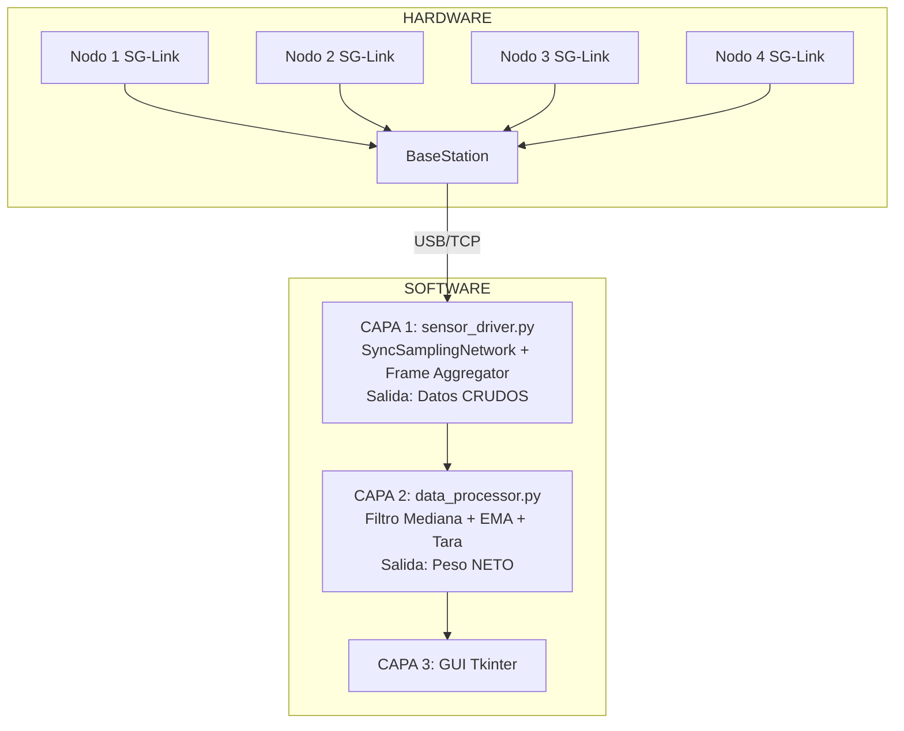
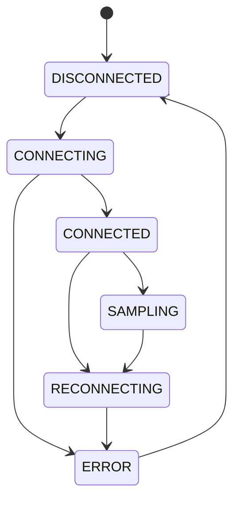
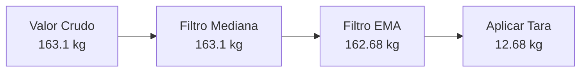
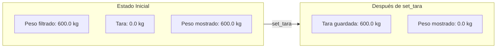
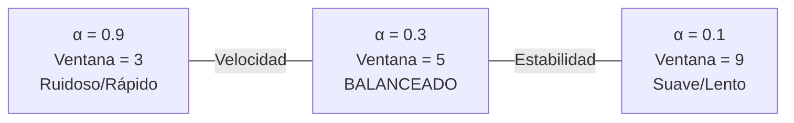

# Guía Técnica de Métodos y Fórmulas
## Sistema de Pesaje Industrial Balanza-Py

**Versión:** 1.0  
**Fecha:** Diciembre 2025  

---

## 1. Arquitectura General del Sistema

### 1.1 Diagrama de Bloques



### 1.2 Separación de Responsabilidades

| Capa | Módulo | Responsabilidad |
|------|--------|-----------------|
| **Adquisición** | `sensor_driver.py` | Comunicación HW, sincronización, agregación |
| **Procesamiento** | `data_processor.py` | Filtrado, tara, detección desconexión |
| **Presentación** | GUI | Visualización |

---

## 2. Adquisición de Datos (sensor_driver.py)

### 2.1 Estados de Conexión



### 2.2 SyncSamplingNetwork

**Protocolo LXRS:** Sincronización de relojes ±50µs entre nodos.

| Parámetro | Valor | Descripción |
|-----------|-------|-------------|
| `TARGET_SAMPLE_RATE_HZ` | 32 Hz | Frecuencia de muestreo |
| `TIMESTAMP_TOLERANCE_NS` | 10 ms | Ventana para agrupar muestras |
| Precisión LXRS | ±50 µs | Tolerancia entre nodos |

**Período de muestreo:**
$$T_s = \frac{1}{32} = 31.25 \text{ ms}$$

### 2.3 Frame Aggregator

**Problema:** Los 4 nodos envían datos individualmente.  
**Solución:** Agrupar por timestamp con tolerancia de 10ms.

| Datos entrantes | Frame resultante |
|-----------------|------------------|
| t=1000.001 N1: 25.3 | `timestamp: 1000.001` |
| t=1000.003 N3: 24.8 | `values: {N1:25.3, N2:25.1, N3:24.8, N4:24.9}` |
| t=1000.002 N2: 25.1 | `complete: true` |
| t=1000.004 N4: 24.9 | |

**Criterios:**
- Frame **completo** = tiene lecturas de los 4 nodos
- Timeout: 50ms para completar un frame

---

## 3. Procesamiento de Datos (data_processor.py)

### 3.1 Pipeline de Filtrado



### 3.2 Filtro de Mediana

**Propósito:** Eliminar picos/outliers.

**Fórmula:** Para ventana de N valores ordenados:
$$\text{Mediana} = x_{\frac{N+1}{2}}$$

**Parámetros:**
- Ventana: 5 muestras
- Latencia: 2 muestras

**Ejemplo:**
```
Buffer: [161.2, 163.5, 500.0, 162.8, 163.1]  <- outlier de 500
Ordenado: [161.2, 162.8, 163.1, 163.5, 500.0]
Mediana: 163.1  <- outlier eliminado
```

### 3.3 Media Móvil Exponencial (EMA)

**Propósito:** Suavizar la señal.

**Fórmula:**
$$EMA_n = \alpha \cdot x_n + (1 - \alpha) \cdot EMA_{n-1}$$

Con α = 0.3:
$$EMA_n = 0.3 \cdot x_n + 0.7 \cdot EMA_{n-1}$$

**Parámetros:**
- α = 0.3 (factor de suavizado)
- Constante de tiempo: τ ≈ 87.5 ms
- Tiempo al 95%: ~262 ms (~8 muestras)

**Ejemplo:**
```
EMA_anterior = 162.5
Valor_actual = 163.1

EMA = 0.3 × 163.1 + 0.7 × 162.5
EMA = 48.93 + 113.75
EMA = 162.68 kg
```

---

## 4. Sistema de Tara

### 4.1 Concepto

**Tara** = Resta matemática que compensa peso muerto.

$$\text{Peso Neto} = \text{Peso Filtrado} - \text{Tara}$$

### 4.2 Ubicación

La tara se maneja en `DataProcessor`.

### 4.3 Tara por Nodo

```python
_tares = {
    63829: 150.5,   # Celda sup. izquierda
    63830: 148.2,   # Celda sup. derecha
    63831: 151.8,   # Celda inf. izquierda
    63832: 149.5    # Celda inf. derecha
}
# Total tara = 600.0 kg
```

### 4.4 Operación set_tara()



**Código:**
```python
def set_tara(self):
    for node_id, ema_value in self._ema_values.items():
        if ema_value is not None:
            self._tares[node_id] = ema_value
```

### 4.5 ¿Por qué Tara Individual?

| Escenario | Tara Global | Tara Individual |
|-----------|-------------|-----------------|
| 4 nodos OK | ✓ Funciona | ✓ Funciona |
| 1 nodo falla | ✗ Peso negativo | ✓ Compensado |

---

## 5. Fórmulas y Constantes

### 5.1 Constantes del Driver

| Constante | Valor | Descripción |
|-----------|-------|-------------|
| `TARGET_SAMPLE_RATE_HZ` | 32 Hz | Frecuencia muestreo |
| `TIMESTAMP_TOLERANCE_NS` | 10 ms | Tolerancia agrupación |
| `FRAME_AGGREGATION_TIMEOUT_MS` | 50 ms | Timeout frame |
| `NODE_TIMEOUT_S` | 5.0 s | Timeout nodo offline |
| `DATA_VALIDATION_MIN/MAX` | ±50,000 kg | Rango válido |

### 5.2 Constantes del Procesador

| Constante | Valor | Descripción |
|-----------|-------|-------------|
| `MEDIAN_WINDOW_SIZE` | 5 | Ventana mediana |
| `EMA_ALPHA` | 0.3 | Factor suavizado |
| `SENSOR_TIMEOUT_S` | 3.0 s | Timeout desconexión |

### 5.3 Fórmulas Clave

**Período de muestreo:**
$$T_s = \frac{1}{f_s} = \frac{1}{32} = 31.25 \text{ ms}$$

**Filtro de mediana:**
$$y_n = \text{median}(x_{n-4}, x_{n-3}, x_{n-2}, x_{n-1}, x_n)$$

**EMA:**
$$EMA_n = 0.3 \cdot x_n + 0.7 \cdot EMA_{n-1}$$

**Constante de tiempo:**
$$\tau = -\frac{T_s}{\ln(1-\alpha)} \approx 87.5 \text{ ms}$$

**Peso neto:**
$$W_{neto} = W_{filtrado} - Tara$$

**Peso total:**
$$W_{total} = \sum_{i=1}^{n} W_{neto,i}$$

---

## 6. Flujo de Datos Completo

### 6.1 Secuencia


### 6.2 Ejemplo Numérico

**Entrada (datos crudos del HW):**

| Celda | Peso |
|-------|------|
| 1 | 163.2 kg |
| 2 | 161.8 kg |
| 3 | 162.5 kg |
| 4 | 162.1 kg |
| **Total** | **649.6 kg** |

**Después de filtros (EMA):**

| Celda | Peso |
|-------|------|
| 1 | 163.06 kg |
| 2 | 161.72 kg |
| 3 | 162.45 kg |
| 4 | 162.08 kg |
| **Total** | **649.31 kg** |

**Taras guardadas:**

| Celda | Tara |
|-------|------|
| 1 | 150.50 kg |
| 2 | 148.20 kg |
| 3 | 151.80 kg |
| 4 | 149.50 kg |
| **Total** | **600.00 kg** |

**Peso neto final:**

| Celda | Cálculo | Resultado |
|-------|---------|-----------|
| 1 | 163.06 - 150.50 | 12.56 kg |
| 2 | 161.72 - 148.20 | 13.52 kg |
| 3 | 162.45 - 151.80 | 10.65 kg |
| 4 | 162.08 - 149.50 | 12.58 kg |
| **PESO NETO TOTAL** | | **49.31 kg** |

---

## 7. Parámetros Configurables

### 7.1 Guía de Ajuste

| Condición | Acción | Parámetro |
|-----------|--------|-----------|
| Señal muy ruidosa | Aumentar ventana | `median_window = 7` |
| Respuesta muy lenta | Aumentar α | `ema_alpha = 0.4` |
| Ambiente con vibración | Reducir α | `ema_alpha = 0.2` |

### 7.2 Trade-off Velocidad vs Estabilidad



---

## Referencias

1. MSCL API Documentation - LORD MicroStrain
2. OIML R76-1 (2006) - Non-automatic weighing instruments
3. Tukey, J.W. (1977) - Exploratory Data Analysis
4. Smith, S.W. (1997) - DSP Guide

---

*Documento generado para Balanza-Py v1.0 - Diciembre 2025*
